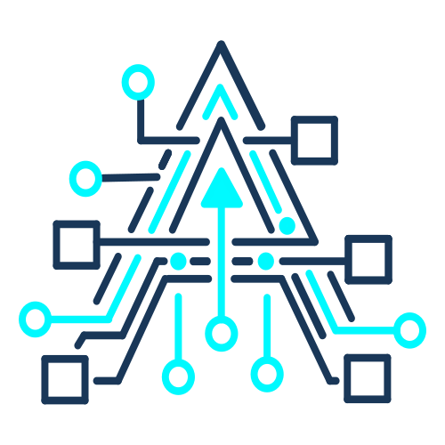

<div align="center">
  

  <h1>ArchIDE</h1>
  <p> Design - Develop - Deploy </p>
  
  ---
  <p><strong>Design systems. Build services. Run software. Keep architecture and implementation in sync.</strong></p>

  <p>
    <a href="https://electronjs.org/"></a>
    <a href="https://react.dev/"></a>
    <a href="https://www.typescriptlang.org/"></a>
    <a href="https://microsoft.github.io/monaco-editor/"></a>
    <a href="https://www.java.com/"></a>
  </p>

  <p><strong>ArchIDE is a local-first desktop IDE for architects, engineers, and product teams who want one workspace for design, implementation, debugging, and delivery.</strong></p>
  <p>Visit the product site: <a href="https://archide.in">archide.in</a></p>
</div>

---

## Why ArchIDE exists

Software is still built in fragments.

Architecture is discussed in diagrams, implementation happens in editors, runtime issues appear in terminals and logs, and the real system state is scattered across too many tools. That gap creates drift, rework, and slow decisions.

ArchIDE exists to change that. It brings architecture, code, runtime, AI assistance, and delivery workflows into one cohesive desktop environment so teams can reason about the system and build it from the same source of truth.

The core vision is simple:

- make architecture tangible instead of document-only
- keep design and implementation synchronized
- accelerate Java and Spring development without sacrificing control
- remain local-first, secure, and offline-friendly
- bring AI collaboration into the IDE without making it a black box

ArchIDE is built for the people who care about both the structure of a system and the quality of the code that realizes it.

---

## What ArchIDE is

ArchIDE is not just another code editor. It is an architecture-aware development environment for modern software teams.

It combines:

- a powerful editor for writing and navigating code
- an architectural canvas for modeling services, boundaries, and relationships
- Java and Spring intelligence for real engineering workflows
- build, run, debug, terminal, and testing tools in one place
- AI assistance that understands both code and architecture context

This repository contains the desktop application source for ArchIDE, built with Electron, React, TypeScript, Monaco, and a deep Java toolchain integration.

---

## Core product vision

ArchIDE is designed around one idea:

> architecture should not live separately from implementation.

Instead of treating diagrams as documentation and code as a separate artifact, ArchIDE aims to make the architecture model and the codebase evolve together.

That means:

- visualizing systems as living topology rather than static drawings
- connecting nodes and services directly to source code
- surfacing drift when implementation diverges from intended structure
- generating and refining code from architectural intent
- giving architects and developers a shared operating environment

---

## Feature overview

ArchIDE brings together a broad set of capabilities across the full software lifecycle.

### 1. Architecture-first workspace

- interactive architecture canvas for modeling services, components, relationships, and boundaries
- multi-level architecture views that help teams move from high-level context to implementation detail
- support for topology-driven workflows and design exploration
- reverse-architecture tools that can derive structure from existing services
- visual representation of system state, drift, and synchronization health

### 2. Code and canvas synchronization

- a code-canvas communication layer that links design artifacts to real source files
- selection and navigation between the canvas and editor
- drift detection when implementation changes away from the intended model
- a shared model that helps keep architecture and code aligned over time

### 3. Advanced editor experience

- Monaco-based editor with tabs, state persistence, semantic highlighting, and rich editor behavior
- virtual file system support for large and complex workspaces
- project navigation, file explorer, structure panels, and search workflows
- local history and workspace state persistence for reliability and recovery

### 4. Java intelligence

- full Java language support through an integrated LSP workflow
- semantic tokens, diagnostics, completions, hover information, go-to-definition, and references
- Java project awareness for navigation and inspection
- support for decompiled source and Java runtime context

### 5. Spring Boot intelligence

- Spring-specific exploration for controllers, services, repositories, beans, and endpoints
- endpoint discovery and inspection
- property and configuration awareness
- Spring-focused project understanding for faster navigation and code generation

### 6. Build and project automation

- Maven and Gradle detection and project analysis
- build execution and output monitoring
- dependency awareness and project discovery
- toolchain integration for building and validating applications from inside the IDE

### 7. Run, launch, and debugging

- run configuration management
- launch configurations for Java applications
- service lifecycle controls
- debugger integration with breakpoints, frames, variables, and thread inspection
- runtime output and session management

### 8. Integrated terminal

- built-in terminal experience for local commands, scripts, and workflows
- terminal sessions with working directory support and interactive execution
- a developer-friendly shell experience inside the desktop app

### 9. AI assistance built into the workflow

- AI chat and assistant experiences for architecture and code assistance
- AI completion workflows for editor-driven help
- context-aware assistance that can work with both code and architecture information
- local-first and provider-configurable AI patterns designed to keep control in the user’s hands

### 10. Testing, deployment, and delivery workflows

- test-runner integration for execution and feedback
- deployment toolchain awareness and workflow support
- service generation and scaffolding for rapid delivery
- support for moving from design to implementation to deployment in one environment

### 11. Version control and workspace continuity

- dedicated version-control and repository workflows as part of the product direction
- workspace persistence, recovery, and session continuity features
- a platform foundation that supports long-running development sessions without losing context

---

## Why this matters

ArchIDE is built for teams that want to move faster without losing clarity.

It helps:

- architects communicate system structure more clearly
- developers work from the same mental model as the design
- teams reduce drift between documentation, architecture, and implementation
- organizations ship software with better alignment between intent and delivery

In short, ArchIDE aims to be the place where software design becomes executable and software development becomes architecture-aware.

---

## Tech stack

ArchIDE is built with a modern desktop stack:

- Electron for the desktop shell
- React and TypeScript for the interface and application logic
- Monaco Editor for the code editing surface
- Zustand for state management
- Java LSP and related toolchains for deep Java awareness
- a local-first architecture and runtime integration layer for workspace intelligence

---

## Getting started

### Prerequisites

- Node.js 18+ recommended
- a working Java environment for Java and Spring support

### Install and run

```bash
npm install
npm run dev
```

### Useful development commands

```bash
npm run typecheck
npm run lint:check
npm run test
```

---

## Project status

ArchIDE is an active, product-oriented IDE platform rather than a simple prototype.

The current codebase already includes:

- architecture canvas workflows
- editor and workspace infrastructure
- Java and Spring intelligence
- build, run, debug, and terminal workflows
- AI-assisted experiences
- local-first persistence and recovery flows

The roadmap continues to expand the IDE into a full, high-productivity environment for modern software delivery.

---

## License

This project is proprietary and intended for product use under its existing commercial terms. See the repository ownership and distribution policy for details.
